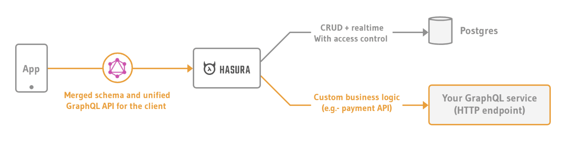
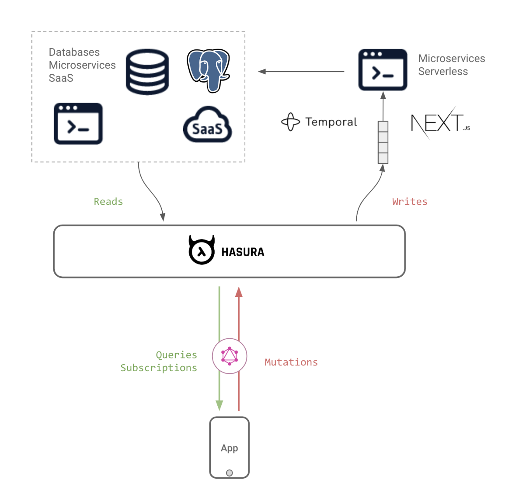

# Stateset Platform

## Stateset

Stateset Platform is the single-source-of-truth for direct-to-consumer merchants and warehouses. Stateset provides a single-point API and event driven ERP for direct-to-consumer merchants to optimize workflows related to reverse logistics, inventory and subscriptions.


### Enable the GraphQL API for your Stateset Project

Stateset projects come with a Hasura GraphQL API by default. After signing up on stateset.io/sign-up you will need to deploy your Stateset Platform backend. You need to deploy the GraphQL API manually.

You can deploy the API only by signing up on stateset.io/signup.

Upon SignUp at https://stateset.io/signup you will receive an email with your Stateset backend URL and Stateset Admin Secret.

* Get the Stateset GraphQL API Endpoint:

```
https://<your-project-name>.stateset.app/v1/graphql
```




### Authentication

.png>)

It’s important to note that all data is accessible only to authenticated users. There are two ways to access data:

* using JWTs
  * JWTs can be generated from your frontend. Each token depicts a user who is authenticated to your Stateset platform instance. Tokens can only be generated for signed in users and each token is _tied to a particular user_.
* using static tokens that are set for each user and do not expire


### Accessing your Stateset Operations Backend

You will need this Stateset Admin Secret Key to access the Stateset GraphQL API. Upon signup you will receive an email with your Stateset Admin Secret Key.

* Now go to the Hasura Project Console, head to Remote Schemas, and enter the GraphQL Server URL you copied from the API Playground.
*   Select the 'Forward all headers from client' option


*   Under Additional Headers,\
    Enter the header name as `Authorization` and in `value` use the following:

    ```
    Authorization: Bearer <your-Stateset-API-Token>
    ```

    or

    ```
    x-hasura-admin-secret: Bearer <Stateset Admin Secret>
    ```

### Adding Stateset as Remote Schema

* All set, now Press the `Add Remote Schema` button to add the remote schema, that's it!



### Stateset Platform Overview

Stateset Platform is an operations platform that aggregates all of the apps across your ecommerce stack into one single view. Stateset brings all the apps that your ecommerce operation team uses into one single view, making their job easier and faster.

The Stateset Platform is built on the following technologies:

* Next.js - React Framework and API Routes
* Tailwind - CSS Framwork
* Hasura - GraphQL Engine

Stateset has CRM, Operations and ERP modules that allow for the creation of standard and custom objects.

The CRM Modules are `Vendors`, `Accounts`, `Contacts`, `Customers`, `Cases` and `Returns`.

The Operations Modules are `Proposals`, `Agreements`, `Applications`, `Approvals`, `Packing List`, `Packing List Items,` `Inventory Items, Returns, Warranties`

The ERP Modules are `Purchase Orders`, `Invoices`, `Subscriptions, Bill of Materials, Work Orders, Manufacture Orders.`

Stateset has a GraphQL API and REST API for updating data in the above objects.

### External Integrations

#### Woocommerce

`Customers`, `Products`, `Product Variants`, `Orders` and `Order Line Items` are coming directly from WooCommerce PIM.

**Products**

`Products` can be tracked as well as `Product Variants` and quantity by variant.

**Orders**

`Orders` and `Order Notes` can be tracked on Stateset.

The `Order` Information is coming directly from WooCommerce

#### ShipStation

**Shipments**

`Shipments` are coming from ShipStation directly into the Stateset Platform. This includes replacement Shipments as well.

Shipments are also related to the WooCommerce `Order` object and can be viewed as a related object under `Order`.

Shipping Labels can be built and created on the platform.

#### Inventory Management

**Inventory Item**

`InventoryItems` are being tracked at SKU level for `incoming`, `warehouse` and `available` counts.

There are three inventory counts by UPC or SKU:

Incoming, Available and Warehouse Counts

Incoming = Packing List Item by UPC Available = Available Count by UPC Warehouse = Available Count by UPC

There are two live deductions happening via ShipStation webhooks to Stateset serverless API lambdas.

These Webhooks are used from ShipStation to manage deducting new orders and new shipments from the `warehouse` and `available` counts.

When a New Order is placed from the Website it will fire the `On New Items (ITEM_ORDER_NOTIFY)` webhook which will reduce the quantity from the `available` count.

When a New Shipment is shipped from ShipStation it will fire the `On Items Shipped (ITEM_SHIP_NOTIFY)` webhook which will deduct the quantity from the `warehouse` count.

```jsx
// *********
// * Inventory Item Object *
// *********

inventory_item:

    id - text, primary key, unique
    sku - text, nullable
    description - text, nullable
    size - text, nullable
    incoming - integer, nullable
    color - text, nullable
    warehouse - integer, nullable
    available - integer, nullable
    arriving - date, nullable
    purchase_order_id - text, nullable
```

The api endpoints are https://stateset.io/api/events/order-created and https://stateset.io/api/events/order-shipped.

Inventory Items can be updated via the inventory list view by clicking the edit button at the end of the row.

Logs (errors: 500, 502 & success: 200) for both of these endpoints can be viewed in Logflare.

The Available and Incoming Counts can be updated directly from Stateset.

**Packing List**

`Packing List` can be imported into Stateset to track incoming shipments `deliveryDate`, `arrivalDate` and as an array relationship with `Packing List Item`.

When a new CSV file is uploaded with Packing List Items, the corresponding SKU in the inventory\_item incoming table is updated.

To deduct the quantity from a packing list item from the inventory item, click the Arrived button. This will remove the quantity from the incoming count and add it to the warehouse and available count for that particular product. You will see the arrived checkbox is marked as checked.

```jsx
// *********
// * Packing List Object *
// *********

packing_list:
  
  id - text, primary key, unique
  number - text, nullable
  deliveryDate - date, nullable
  invoice_number - text, nullable
  arrivalDate - date, nullable
  purchase_order_number - text, nullable
  ship_per - text, nullable
  tracking_number - text, nullable
  
```

Packing List can be created and a CSV file with the packing list items can be uploaded with the headers id, sku, upc, description and quantity. This will usually take between 10-15 seconds; please do not exit of the modal until you see the packing list number appear in the list view.

Packing List Items can also be added individually to a Packing List and will also update the incoming counts accordingly by UPC. The Packing List details can be updated via the Packing List Record.

**Packing List Item**

`Packing List Item` will have a `sku`, `upc`, `description` and a `quantity`. The `Packing List Item` looks up to the `Packing List` and has a junction with `Inventory Item` by `sku`.

```jsx
// *********
// * Packing List Item Object *
// *********

packing_list_item:

  id - text, primary key, unique
  sku - text
  description - text
  quantity - integer
  packing_list - text
```

#### Stripe

**Customers**

Stripe Customers can be created and updated via the Stateset interface and via GraphQL Mutation.

```jsx
  // Create Customer with SSO ID
  
  mutation StripeCreateCustomerMutation {
  stripe {
    createCustomer(
      data: {
        name: "test-stateset-dev"
        metadata: { sso_id: "ab6e0d9b-4a93-452e-ae44-f8e0fd02d5cc"}
      }
    ) {
      customer {
        id
        name
        email
        metadata
      }
    }
  }
}


// Update Stripe Custmer Mutation:

mutation StripeUpdateCustomerMutation {
  stripe {
    updateCustomer(
      data: {
        customerId: "cus_IRxQNlLCwLWHIv"
        patch: { name: "test-stateset-dev" }
      }
    ) {
      customer {
        id
        name
        email
        metadata
      }
    }
  }
}
```

**Charges**

`Charges` can be integrated and brought in via Stipe and directly integrated into Stateset. This includes refunding `Charges`.

**Refunds**

`Refunds` can be integrated and processed from the platform directly back in WooCommerce. The Charge Id and the Amount can be placed from the `Customer` record as well as the `Return` Record.

The Return Information and Condition of the Returned Items can also be sent back to the Zendesk Ticket.

```jsx
// Refund a Stripe Charge Mutation:

mutation {
  stripe {
    refundCharge(data: {chargeId: ""}) {
      refund {
        amount
        id
        reason
        status
      }
    }
  }
}
```

**Subscription**

`Subscriptions` are powered by Stripe and can be updated in real-time from Stateset.

`Subscriptions` can be cancelled via Graph Mutation as well as directly from the Customer Record.

```jsx
// Cancel Stripe Subscription Mutation:

mutation StripeCreateCancelSubscriptionMutation {
  stripe {
    cancelSubscription(data: {subscriptionId: ""}) {
      subscription {
        id
        metadata
        canceledAt
        currentPeriodStart
        currentPeriodEnd
        status
      }
    }
  }
}
```

#### Customers

`Customers` can also be viewed via Stateset.

The `Customers` in Stateset are directly linked to the Stripe `Customer` object by the `stripe_customer_id`.

New `Customers` can be created or updated by calling the UpdateCustomer API.

```bash

POST https://stateset.io/api/users/update-users

body: 

{
	"sso_id": "20006451-0026-402b-354e-542920373038", 
	"first_name": "John",
	"last_name": "Michaels",
	"email": "john@customer.com",
	"timestamp": "2021-01-19T20:45",
	"stripe_customer_id": "cus_IZJrWrawXCDDSG"
}
```

`Customers` can be fetched by `sso_id` with `stripe_data` by calling the GetCustomer API.

```bash
POST https://stateset.io/api/users/get-customer

body:

{
	"sso_id": "20006461-0026-002b-354e-501620373058"
}
```

```jsx
// *********
// * Customers Query *
// *********

    query getCustomer($sso_id: uuid!) {
      customers: customers_by_pk(sso_id: $sso_id) {
        sso_id
        firstName
        lastName
        email
        stripe_customer_id
        activationDate
        stripe_data {
          id
          metadata
          subscriptions {
            data {
              id
              metadata
              created
              cancelAt
              currentPeriodStart
              currentPeriodEnd
              defaultPaymentMethod {
                billingDetails {
                  address {
                    line1
                    line2
                    city
                    postalCode
                    state
                  }
                }
                card {
                  brand
                  expMonth
                  expYear
                  last4
                }
              }
              plan {
                id
                metadata
                nickname
                created
              }
              items {
                data {
                  id
                  metadata
                  price {
                    nickname
                    unitAmount
                    recurring {
                      aggregateUsage
                      usageType
                    }
                  }
                }
              }
            }
          }
        }
      }
    }
```

#### API Access

Stateset strives to streamline all ecommerce operations for online sellers, no matter where they sell their products online. We are continuously adding new marketplaces, shopping carts, and integration tools, because we know the e-commerce space is growing. As a result, we’ve worked hard to provide developer resources to build custom integrations with Stateset.

**Stateset API**

The API is a great way to get data directly to and from Stateset, like creating purchase orders, updating products, and querying order, shipment and customer data.

Our API is available for any plan and allows developers to build applications that interface with the Stateset platform. The API can be used to automate many tasks including:

Managing Agreements Managing Purchase Orders Managing Invoices

**Connect**

To Retrieve a Stateset API token call the following endpoint:

```bash
POST https://stateset.io/api/connect/token

body:

{ "client_id": "{email}", "client_secret": "xxxxxxxxxxxxxxxx" }

```

To Check if you are authenticated call the following endpoint:

```bash
POST https://stateset.io/api/authenticatedStatus
```

#### Stateset Serverless APIs

#### Returns Management (RMA)

Returns Management can be found on the `Returns` tab.

`Returns` can be processed via a Zendesk / Gorgias Ticket or directly from the `Returns` tab.

**Return Ticket Approved**

Returns are being created in Stateset when an RMA request is approved by a CSR in Zendesk.

The https://stateset.io/api/events/return-ticket-approved API is being called with parameters from the Zendesk ticket.

These parameters are then used to create a fedex return label with the customers information; as well as the RMA number, condition and reason on the label as custom fields. The return label is sent to the customer via email so they can print it out and send back the product. Lastly, the return label tracking number is sent back to zendesk as a private comment so the CSR can track the return. If the label doesnt print (or the the tracking number isnt sent to the zendesk ticket), a log can be found using the logflare app and an email of the error will also be sent to csrreturns@customer.com.

Return Approved API

```bash
POST https://stateset.io/api/events/return-ticket-appoved

body:

{
  (parameters from zendesk ticket custom fields)
}
```

**Refunds**

The return record in Stateset will include customer information such as the order id which is used to query the total order amount and tax amount.

These values are used to calculate the total refund amount depending on the restocking fee. A refund can be placed via the Return record which will trigger a refund in WooCommerce and then Stripe. It may take a few days for the refund to appear on the customers debit card. The refund can be verified in Stateset by going to the Stripe returns list view.

The condition and rationale from the return record can also be sent back to Zendesk from Stateset as a private message for the CSR.


#### Warranty Ticket Approved

Warranty have a similar process as the above but will create a Warranty record in Stateset and there is no refund process.

The https://stateset.io/api/events/warranty-ticket-approved endpoint is being called via a Zendesk Webhook similar to returns.

An email will be sent to csrreturns@customer.com as soon as the item is picked via FedEx.

Warranty Ticket Approved API

```bash
POST https://stateset.io/api/events/warranty-ticket-appoved

body:

{
  (parameters from zendesk ticket custom fields)
}
```

Once a ticket has been approved for a Warranty replacement, notifications as to when it is shipped will be sent.

#### FedEx Return Labels

Return Labels are being generated and sent to the customer with a bcc: `csrreturns@stateset.io`.

**Zendesk and AI**

Intelligent ReSponses to customer service tickets can be sent using state-of-the-art language models that are leveraging the knowledge base. These responses can be automatically generated from the Stateset Zendesk Tickets list view. The response can then be sent back to the customer by updating the Zendesk ticket from Stateset. The AI can be leveraged in QA format (chat), search, or for replying to tickets based on the subject and description. The AI can leverage any data from Stateset including Product, Payment, Shipping and Zendesk Knowledge base data in the response. The answers can also prevent a return based on the data available.

Usage for the AI will be metered or can be included as part of monthly Stateset subscription.

Zendesk Tickets are in Stateset and can be updated directly from the Zendesk tab.

Customer Service reps can also leverage Stateset's state-of-the-art NLP engine to auto-respond to tickets based on the Subject and Body to the Ticket.

This auto-generated response can the be used as a comment on the ticket.

Tickets that are tagged with `rma` will automatically create a `Return` in Stateset.

Webhooks have been setup in Zendesk to automatically create the `Return` as well as create a `Return Shipping Label`.

The following fields are available on the `Return` object:

```jsx
// *********
// * Return Object *
// *********

return:
    id - text, primary key, unique
    status - text, nullable
    order_id - text, nullable
    rma - text, nullable
    tracking_number - text, nullable
    description - text, nullable
    customer_id - text, nullable
    customerEmail - text, nullable
    zendesk_number - text, nullable
    action_needed - text, nullable
    issue - text, nullable
    order_date - date, nullable
    shipped_date - date, nullable
    requested_date - date, nullable
    enteredBy - text, nullable
```

### Stateset Network

#### Stateset Network Setup

1. Install Stateset Network locally via Git:

```bash
git clone https://github.com/stateset/stateset
```

1. Deploy the Nodes

```bash
cd stateset && gradlew.bat deployNodes (Windows) OR ./gradlew deployNodes (Linux)
```

1. Run the Nodes

```bash
cd workflows
cd build 
cd nodes
runnodes.bat (Windows) OR ./runnodes (Linux)
```

1. Run the Spring Boot Server

```bash
cd ..
cd ..
cd server
../gradlew.bat bootRun -x test (Windows) OR ../gradlew bootRun -x test
```

The Stateset Network API Swagger will be running at `http://localhost:8080/swagger-ui.html#/`

To change the name of your `organisation` or any other parameters, edit the `node.conf` file and repeat the above steps.

#### Joining the Network

Add the following to the `node.conf` file:

`compatibilityZoneUrl="https://stateset.network:8080:8080"`

This is the current network map and doorman server URL for Stateset Testnet

1. Remove Existing Network Parameters and Certificates

```bash
cd build
cd nodes
cd PartyA
rm -rf persistence.mv.db nodeInfo-* network-parameters certificates additional-node-infos
```

1. Download the Network Truststore

```bash
curl -o /var/tmp/network-truststore.jks http://stateset.network:8080:8080//network-map/truststore
```

1. Initial Node Registration

```bash
java -jar corda.jar --initial-registration --network-root-truststore /var/tmp/network-truststore.jks --network-root-truststore-password trustpass
```

1. Start the Node

```bash
java -jar corda.jar
```

### Stateset Overview

Stateset is a global network of nodes for enterprise-grade, real-time transactions and asset workflows. It is a platform for developing the next-generation of enterprise software where state and processes can be shared and uniform across multiple trusted entities leading to operational efficiency, speed and better customer experiences. What does the Business-to-Business enterprise space look like when there is a real-time network for shared processes, state and transfer of value. Globally reachable like a next gen Bloomberg but not just for trades and messaging but for any front-office, middle-office or back-office application. The future state is that there is much more secure, automated and deterministic business process based; assets and value flow freely across the business network and are interoperable with other sector specific business networks.

#### Stateset Network Setup

Go to Stateset on the Shopify App Store install the app or at stateset.io/signup

* Encrypted Middleware and API for Stateset Network
* Corda Node Container
* Connected to Stateset Network Map
* Spring Boot Webserver
* Braid Websocket for Events

Now that you are connected to `https://stateset.network:8080` you can start sending states with other organizations that are part of the network.

#### State models

There are many different types of assets that can be transacted on Stateset.

Customer States are transferred between stakeholders on the network.

#### Network States

Stateset provides structured format for States to be messaged on the network.

**Accounts**

The first state to be deployed on the network is the `Account`. Version 0.1 of the `Account` State has the following structure:

```jsx
// *********
// * Account State *
// *********

data class Account(val accountId: String,
                   val accountName: String,
                   val accountType: TypeOfBusiness,
                   val industry: String,
                   val phone: String,
                   val yearStarted: Int,
                   val annualRevenue: Double,
                   val businessAddress: String,
                   val businessCity: String,
                   val businessState: String,
                   val businessZipCode: String,
                   val controller: Party,
                   val processor: Party ) : ContractState, QueryableState {

```

The Account has the following business `flows` that can be called:

* `CreateAccount` - Create an Account between your organization and a known counterparty on Stateset
* `TransferAccount` - Transfer the Account between your organization and a counterparty on Stateset
* `ShareAccount` - Share the Account Data with a counterparty
* `EraseAccount` - Erase the Account Data

**Contacts**

The second state to be deployed on the network is the `Contact`. Version 0.1 of the `Contact` State has the following structure:

```jsx
// *********
// * Contact State *
// *********

data class Contact(val contactId: String,
                   val firstName: String,
                   val lastName: String,
                   val email: String,
                   val phone: String,
                   val controller: Party,
                   val processor: Party,
                   override val linearId: UniqueIdentifier = UniqueIdentifier())

```

The Contact has the following business `flows` that can be called:

* `CreateContact` - Create a Contact between your organization and a known counterparty on Stateset
* `TransferContact` - Transfer the Contact between your organization and a counterparty on Stateset
* `ShareContact` - Share the Contact Data with a counterparty
* `EraseContact` - Erase the Contact Data

**Leads**

The third state to be deployed on the network is the `Lead`. Version 0.1 of the `Lead` State has the following structure:

```jsx
// *********
// * Lead State *
// *********

data class Lead(val leadId: String,
                val firstName: String,
                val lastName: String,
                val company: String,
                val title: String,
                val email: String,
                val phone: String,
                val country: String,
                val controller: Party,
                val processor: Party,
                override val linearId: UniqueIdentifier = UniqueIdentifier())

```

The Lead has the following business `flows` that can be called:

* `CreateLead` - Create a Lead between your organization and a known counterparty on Stateset
* `TransferLead` - Transfer the Lead between your organization and a counterparty on Stateset
* `ShareLead` - Share the Lead Data with a counterparty
* `EraseLead` - Erase the Lead Data
* `ConvertLead` - Convert a Lead State into an Account State and Contact State

We created the `CRM Dashboard` to provide the ability for organizations to create `Accounts`, `Contacts`, and `Leads` with counterparties on the network.

**Cases**

```jsx
// *********
// * Case State *
// *********

data class Case(val caseId: String,
                val description: String,
                val caseNumber: String,
                val caseStatus: CaseStatus,
                val casePriority: CasePriority,
                val submitter: Party,
                val resolver: Party,
                override val linearId: UniqueIdentifier = UniqueIdentifier()) 

```

The Case has the following business `flows` that can be called:

* `CreateCase` - Create a Case between your organization and a known counterparty on Stateset
* `StartCase` - Start on an unstarted Case
* `CloseCase` - Close the Case with a counterparty
* `EscalateCase` - Escalate the Case

**Proposals**

The seventh state to be deployed on the network is the Proposal. Version 0.1 of the Proposal State has the following structure:

```jsx
// *****************
// * Proposal State *
// *****************

@BelongsToContract(ProposalContract::class)
data class Proposal(val proposalNumber: String,
                     val proposalName: String,
                     val proposalHash: String,
                     val proposalStatus: ProposalStatus,
                     val proposalType: ProposalType,
                     val totalProposalValue: Int,
                     val party: Party,
                     val counterparty: Party,
                     val proposalStartDate: String,
                     val proposalEndDate: String,
                     val active: Boolean?,
                     val createdAt: String?,
                     val lastUpdated: String?,
                     override val linearId: UniqueIdentifier = UniqueIdentifier()) : ContractState, LinearState, QueryableState {
```

The Proposal has the following business `flows` that can be called:

* `CreateProposal` - Create an Proposal between your organization and a known counterparty on Stateset
* `AcceptProposal` - Accept the Proposal between your organization and a counterparty on Stateset
* `RejectProposal` - Reject the Proposal between your organization and a counterparty on Stateset

The `Proposal Status` and `Proposal Type` enums are listed as follows:

```jsx
@CordaSerializable
enum class ProposalStatus {
    REQUEST, APPROVAL_REQUIRED, APPROVED, IN_REVIEW, ACCEPTED, REJECTED
}

@CordaSerializable
enum class ProposalType {
    NDA, MSA, SLA, SOW, PO
}
```

**Agreements**

```jsx
// *****************
// * Agreement State *
// *****************

@BelongsToContract(AgreementContract::class)
data class Agreement(val agreementNumber: String,
                     val agreementName: String,
                     val agreementHash: String,
                     val agreementStatus: AgreementStatus,
                     val agreementType: AgreementType,
                     val totalAgreementValue: Int,
                     val party: Party,
                     val counterparty: Party,
                     val agreementStartDate: String,
                     val agreementEndDate: String,
                     val active: Boolean?,
                     val createdAt: String?,
                     val lastUpdated: String?,
                     override val linearId: UniqueIdentifier = UniqueIdentifier()) : ContractState, LinearState, QueryableState {

```

The Agreement has the following business `flows` that can be called:

* `CreateAgreement` - Create an Agreement between your organization and a known counterparty on Stateset
* `ActivateAgreement` - Activate the Agreement between your organization and a counterparty on Stateset
* `TerminateAgreement` - Terminate an existing or active agreement
* `RenewAgreement` - Renew an existing agreement that is or is about to expire
* `ExpireAgreement` - Expire a currently active agreement between you and a counterparty

The `Agreement Status` and `Agreement Type` enums are listed as follows:

```jsx

@CordaSerializable
enum class AgreementStatus {
    REQUEST, APPROVAL_REQUIRED, APPROVED, IN_REVIEW, ACTIVATED, INEFFECT, REJECTED, RENEWED, TERMINATED, AMENDED, SUPERSEDED, EXPIRED
}

@CordaSerializable
enum class AgreementType {
    NDA, MSA, SLA, SOW
}
```

**Loans**

```jsx

// *****************
// * Loan State *
// *****************

@BelongsToContract(LoanContract::class)
data class Loan(val loanNumber: String,
                val loanName: String,
                val loanReason: String,
                val loanStatus: LoanStatus,
                val loanType: LoanType,
                val amountDue: Int,
                val amountPaid: Int,
                val amountRemaining: Int,
                val subtotal: Int,
                val total: Int,
                val party: Party,
                val counterparty: Party,
                val dueDate: String,
                val periodStartDate: String,
                val periodEndDate: String,
                val paid: Boolean?,
                val active: Boolean?,
                val createdAt: String?,
                val lastUpdated: String?,
                override val linearId: UniqueIdentifier = UniqueIdentifier()) : ContractState, LinearState, QueryableState {

```

The Loan has the following business `flows` that can be called:

* `CreateLoan` - Create a Loan between your organization and a known counterparty
* `PayLoan` - Pay off a Loan

**Invoices**

```jsx

// *****************
// * Invoice State *
// *****************

@BelongsToContract(InvoiceContract::class)
data class Invoice(val invoiceNumber: String,
                   val invoiceName: String,
                   val billingReason: String,
                   val amountDue: Int,
                   val amountPaid: Int,
                   val amountRemaining: Int,
                   val subtotal: Int,
                   val total: Int,
                   val party: Party,
                   val counterparty: Party,
                   val dueDate: String,
                   val periodStartDate: String,
                   val periodEndDate: String,
                   val paid: Boolean?,
                   val active: Boolean?,
                   val createdAt: String?,
                   val lastUpdated: String?,
                   override val linearId: UniqueIdentifier = UniqueIdentifier()) : ContractState, LinearState, QueryableState {

```

The Invoice has the following business `flows` that can be called:

* `CreateInvoice` - Create a Invoice between your organization and a known counterparty
* `PayInvoice` - Pay an Invoice
* `FactorInvoice` - Factor an Invoice

**Purchase Orders**

```jsx
// ************************
// * Purchase Order State *
// ************************

@BelongsToContract(PurchaseOrderContract::class)
data class PurchaseOrder(val purchaseOrderNumber: String,
                         val purchaseOrderName: String,
                         val purchaseOrderHash: String,
                         val purchaseOrderStatus: PurchaseOrderStatus,
                         val description: String,
                         val purchaseDate: String,
                         val deliveryDate: String,
                         val subtotal: Int,
                         val total: Int,
                         val purchaser: Party,
                         val vendor: Party,
                         val createdAt: String?,
                         val lastUpdated: String?,
                         override val linearId: UniqueIdentifier = UniqueIdentifier()) : ContractState, LinearState, QueryableState {
```

The Purchase Order has the following business `flows` that can be called:

* `CreatePurchaseOrder` - Create a PO between a purchaser and a vendor on Stateset
* `CompletePurchaseOrder` - Completes the PO
* `CancelPurchaseOrder` - Cancels the PO

### Stateset Network

#### Distributed Systems of Agreement

The enterprise software industry of cloud applications has created efficiencies but lacks a networked layered of verifiable integrity for agreements, assets and the financial elements of active contracts between stakeholders. The Distributed System of Agreement (Stateset) is a new platform for companies to interact in unison leading to verifiable verticalization.

The next generation of b2b enterprise computing has arrived and is based on a substrate where companies are operating in unison with verifiable, replicated processes and data to yield top line growth. The Stateset is a blockchain platform that is on a mission is to serve as the interface into the enterprise-grade business networks for the world. There will be a collective oneness for all businesses where data is owned by the customer, processes are distributed amongst a network of peers and nodes in the network at scale. This is the natural progression of computing where the enterprise now can ensure the integrity of their data and replicate the processes amongst multiple partners in a vertical.

Nodes on the network can instantly communicate with other nodes on the network in real-time on a global transaction ledger. All the business information that is called on by Smart Contracts will be the same across every node in the network and run in a trusted executable environment to create a secure encrypted ledger.

Now that you are connected to `stateset.network:8080` you can start sending agreements and assets with other organizations that are part of the network.

The purpose of this `Business Network` is for stakeholders to come to a shared set of historical facts related to customer data.

#### What is a Business Network?

If a business network is a group of independent parties transacting together, then its purpose is to allow its members to create a shared representation of information, or facts, and to then use shared processing of those facts to achieve agreement, or consensus, about operations involving them.

This ability to enable both shared understanding of facts, and shared understanding about how they are to be used is something uniquely powerful within DLT/blockchain systems. Earlier systems focused on the shared representations of information, but could neither consistently guarantee its correctness, nor ensure that all participants processed things in the same way. The Corda promise is that "I know I see what you see" after each operation between involved parties.

Achieving the Corda promise requires shared business logic, which for Corda is reflected in the design and development of CorDapps (Corda Distributed Applications) that are shared among parties engaged in the same business processing. The paramount shift to developing shared business logic in CorDapps not only improves the correctness of the shared data, but also eliminates the expensive and error-prone approach of interacting parties implementing their own interpretation of required business logic. Ultimately, this shared business logic, the CorDapps, form the basis of a business network.

The model of Corda business networks also enables something particularly powerful. It allows for the possibility that one business network can build upon the work of another, and that others can then build on top of that.

However, while Corda enables business networks, it deliberately sets out to have few "opinions" about what they might be, or exactly how they should work. Instead, Corda attempts to define some mechanisms to allow for the construction of business networks, and leaves the rest rather open-ended. This flexibility means it is possible to build both very simple and very complex designs, but, as with most software, over-simplified designs often miss essential functionality, while over-complex ones are almost impossible to get right.

\_Source: https://solutions.corda.net/business-networks/what-is-a-business-network.html

#### Stateset Network Map

Go to the `Network Map` tab and you can see other organizations that are part of the network.

The interface will populate with known legal entities that are part of the network.

#### Identity

#### Stateset Network Participants

Identity is managed for individual users leveraging Hyperledger Indy Credentialing.

_Note: This is the first iteration of Stateset Network and the following roles are subject to change for future networks._

**Members**

**Asset Issuer**

**Regulator**

**Auditor**

#### Transaction Validation

#### Oracle Services

Oracle services are provided natively by the Corda Protocol Chainlink and by Oraclize. The Oraclize service can be called at the beginning of a flow to get validation data from a trusted source.

#### Stateset Notary

**Consensus Mechanisms**

#### Network Governance

It is critically important that a commercial entity should not control Corda Network going forwards, and that it should be governed transparently, with a fair and representative structure that can deliver a stable operating environment for its members in the long term.

A separate entity called Stateset Network Foundation has been set up, using a not-for-profit legal entity type known as a Stichting, residing in the Netherlands. This type is suited for governance activities, able to act commercially, with limited liability but no shareholders, capital or dividends. Its constitution is defined in a set of Articles of Association and By-laws.

A Foundation enables Network participants to be involved with, and also understand, how decisions are made (including around issues of identity and permission), building trust and engagement from a wide range of stakeholders. We believe this will bring about the best decisions and outcomes for the Network’s long-term success.

Its governance bodies shall include:

* A Governing Board (‘the Board’) of 11 representatives (‘Directors’).
* A Technical Advisory Committee (‘the TAC’), comprised of representatives of Participant organisations.
* A Governance Advisory Committee, comprised of representatives of Participant organisations.
* A Network Operator (‘the Operator’), charging the Foundation reasonable costs for providing network and administration services, paid by the Foundation through membership funds, and accountable directly to the Board. Operating on behalf of:

Participants (‘Participants’), open to any legal entity participating in Corda Network, and independent of R3 alliance membership.

_Nodes are up with 99.999% up time once deployed in Stateset._

#### Network Onboarding

#### Business Network Operator

Stateset Inc, is the BNO of Stateset Network.

**Business Network Operator Services**

The set of services provided by a business network operator node vary by application. The following sections discuss typical services that may be required:

**Membership Management**

In addition to the assignment of a base identity to a Corda node that ensures each node across all business networks have a unique identity, each business network performs its own deeper membership management process, e.g., registration, licensing, and KYC/AML checks. While the exact requirements for each business network are governed by the network policies, the process of allowing nodes to join and transact on a network will be performed by the BNO node.

A certificate will be provided to non-natural persons, i.e. organisations that are an incorporated legal entity. The following information should be provided by all Participants seeking access to Corda Network:

* Entity name
* Entity Address
* Contact Name
* Contact Email Address
* Contact Phone Number
* Unique ID – (GLEIF ID, EIN, CRN, etc.)
* Website Domain (Optional)

_Note: additional details may be required for Participation billing, but these requirements do not form part of this Policy._

The Operator must conduct a sanction review commensurate with jurisdictional laws and regulations on all entities and establish a process to clear false positives. Positive matches will not receive a certificate for the network. Business Network Operators must perform their own KYC check and should not rely on the Operator’s identification or sanction review. Business Network Operators are responsible for obtaining further documentation such as articles of incorporation, ultimate beneficial owners, etc. to verify identity and conduct appropriate due diligence checks (high risk industry analysis, high risk geographies, negative news checks) to ensure entities meet acceptable risk tolerance standards designed by the business network.

Certifications will be issued based on the information provided in the certification request. Any changes to information provided, including updating the entity name or contact information, will require a certification to be revoked and subsequently re-issued by the operator.

_Source: https://corda.network/policy/admission-criteria.html_

**Master Data Management**

A common requirement for business networks is the need to maintain a set of shared master data that pertains to the application domain and made available to all business network participating nodes. This data may be served via an API, messaging system, or stored on-ledger, and governed by one more contracts.

**Authorisation**

Depending on the network policies, certain activities such as vault synchronisations or upgrades may require authorisation from the business network operator node.

**Monitoring & Reporting**

For commercial, operational or regulatory reasons it is often a requirement to monitor and/or report on network level metrics. For example, an operator may want to monitor network health by tracking operational metrics such transaction volumes and latency. It may also choose to bill its members (periodically or on-demand) by tracking transactions across the network. The network may be designed to reveal as much or as little about the transactions as appropriate.

**Announcements & Signaling**

Certain network level events such as planned maintenance, outages and upgrades must be communicated to all network users. In many cases, traditional communications channels may suffice but in some cases it may be appropriate to use a BNO service to distribute such information such that it can be integrated into the application itself.

**Software Distribution**

Although distribution of CorDapp jars and other shared dependencies may be managed via traditional deployment software tools, it may be appropriate to integrate this into the network itself.

\_Source: https://solutions.corda.net/business-networks/business-network-operator-node.html

**Network Deployments**

This is the policy for the deployment of software components by the Operator onto physical infrastructure for Stateset Network.

Wherever possible, deployment procedures shall be executed via an automation tool or combination of tools. The Operations team is responsible for selecting an appropriate tool, or combination of tools, for each element of a deployment procedure requiring automation. The default preferred tools for each activity are listed below; these should be used for all deployment procedures in the absence of technical obstacles.

The Operations team may, at its discretion, select an alternative tool to perform a given task where the default tool is determined to be unfit for purpose. The rationale for using alternative tooling should be documented within the associated deployment procedure(s).

* Overall deployment operation: `Ansible`
* Code build & packaging: `Gradle`
* Cloud infrastructure provisioning: `Terraform`

The Operations team is responsible for ensuring that all tools used in deployment procedures are themselves updated, and that the testing of the deployment process traps for any version compatibility issues between deployment tools and the software being deployed.

#### Network Financial Model

The network commercial model is to charge on a per month basis for access to the network.

The operating costs factor are related to the opeating costs associated with running the nodes in JVMs in addition to paying developers for the ongoing improvement of the network.

The network is for profit and members will be charged by Stateset Inc. to transact accounts, contacts, agreements, loans, invoices, cases and other transactions across the network.

Associated costs for ongoing maintenance of the network as well as additional services will be available for purchase.

### Data

#### Data Privacy

All data is encrypted at rest and owned by the customer in their own secure container.

Governing law is local to the users jusrisdiction.

**GDPR**

GDPR is enforced on Stateset. The following are key definitions as they pertain to Stateset.

* `Personal Data`: means any information relating to an identified or identifiable natural person (‘data subject’). In turn, an identifiable natural person is one who can be identified, directly or indirectly, in particular by reference to an identifier such as a name, address, an identification number (such as a passport or a social security number), location data, telephone number, an online identifier or log in details or to one or more factors specific to the physical, physiological, genetic, mental, economic, cultural or social identity of that natural person. First Name and Last Name can be personal data if linked to other data (or otherwise independently if they are not common names).
* `Data Controller`: "controller" means the natural or legal person, public authority, agency or other body (each, a "person") which, alone or jointly with others, determines the purposes and means of the processing of personal data; where the purposes and means of such processing are determined by Union or Member State law, the controller or the specific criteria for its nomination may be provided for by Union or Member State law.
* `Data Processor`: any person (other than an employee of the data controller) who processes the data on behalf of the data controller.
* `Processing`, in relation to information or data means obtaining, recording or holding the information or data or carrying out any operation or set of operations on the information or data, including:
* organization, adaptation or alteration of the information or data,
* retrieval, consultation or use of the information or data,
* disclosure of the information or data by transmission, dissemination or otherwise making available or
* alignment, combination, blocking, erasure or destruction of the information or data.

_Source: https://corda.network/policy/gdpr.html_

Customer data is represented a historical set of states between controllers and processors.

#### Data Retention

The need to prune data on the network map arise over time. Therefore it is imperative that members of Stateset establish rules for their organziation and policies to ensure efficient keeping of state.

#### Data Resiliency

#### Data Processing Standard

#### Data Security

The Foundation will implement an information security management program with three main components:

* An information risk management program which will identify, assess and prioritise information security risks to the business. The program will produce an information risk register together with proposed activities to control the risks identified. Those activities will be assessed and prioritised in the light of the impact and likelihood of the risks they address, combined with cost of the control activities themselves. The output of this process will be a prioritised program of activities to establish and maintain a security posture that is aligned to the Foundation’s business objectives and attitude to risk.
* An information security management capability that delivers the program of work defined by the information risk management program and carries out other major, or highimpact, security projects. The information security management capability will oversee the design and implementation of an information security management system (ISMS) for the Foundation. The ISMS will define such policies, procedures, standards and guidelines as are necessary to maintain the Foundation’s desired security posture.
* A security operations capability, that monitors and maintains the Foundation’s security posture, provides a security incident response capability and executes smaller projects of limited impact. The security operations capability will operate the information security management system.

_Source: https://corda.network/policy/security.html_

### Terms of Service

Before actively participaing in Stateset Network, Stateset Inc. will provide the customer with the following Terms of Service for all of the Network Services it provides. At a minimum, Terms of Service shall include clear, explicit statements to cover the following:

* Identification of Service Operator including relevant contact information, trade registry reference number, legal status and regulated status.
* Description of the Network Service offered, including technical detail where relevant to its access and operation.
* Conditions of service, which may include:
* Any requirements for the User to enter into prior agreements with the Service Operator
* Applicable hours of operation
* Specific conditions under which service may be withheld (e.g. legal, regulatory constraints etc.)
* Data restrictions: Data which Users are prohibited from sending to the Network Service
* Commitments to deliver a specific level of performance, specifying relevant metrics (e.g. throughput, latency etc.), and how they are measured
* Commitments to ensure a specific level of availability (uptime) including provisions for planned and unplanned outages
* Charges due to the Service Operator in relation to the Network Service, and how these are to be paid
* Acceptance of liability for improper service
* Dispute resolution procedures, including means to contact the Service Operator
* Compensation scheme(s) applicable in the event of financial losses by a User due to improper service, and procedures for accessing scheme(s)
* Disclosures arrangements (see 2.6)
* Data handling: Treatment and arrangements for secure management of data provided to the Network Service by Users
* Data retention: Policy on the retention and deletion of data provided to the Network Service by Users
* Geographical location of all resources (databases, servers etc.) making up the Network Service, naming specific countries in which resources may reside. Where resources are distributed over more than one country, the division of resources across countries shall be unambiguously described.
* Governing law: Which set(s) of legislation shall be considered to govern the Terms of Service
* Process for changes to the Terms of Service, including notice given to Participants and notification procedures
* Process for termination of the Network Service, including requirements for advance notice and migration, where relevant Where any of the above do not apply to a Network Service, the Terms of Service shall include explicit statements to this effect.
